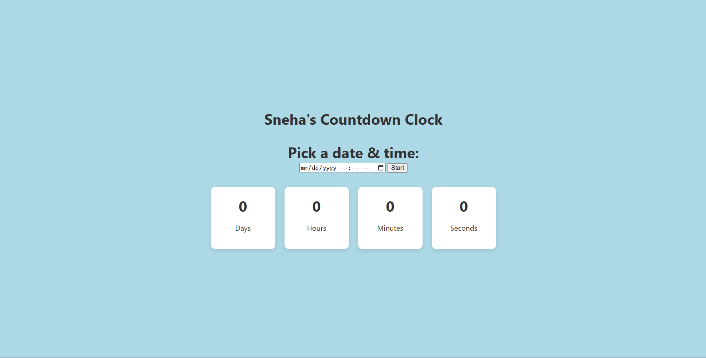

# Countdown Clock

A countdown clock that counts down to a selected date and time in real time.

## About

This is a web-based countdown clock built using HTML, CSS, and JavaScript.  
Users can select a target date and time, and the app displays the remaining days, hours, minutes, and seconds in real time.  
I built this project to practice working with JavaScript `Date` objects, timers, and dynamic UI updates.

## Built With

`HTML` `CSS` `JavaScript`

## What I Learned

- How to work with time calculations using JavaScript and update the countdown every second using `setInterval()`.

## Links

- [Live Demo](https://snehashrestha123.github.io/Countdown-Clock/ )
- [Source Code](https://github.com/Snehashrestha123/Countdown-Clock)
